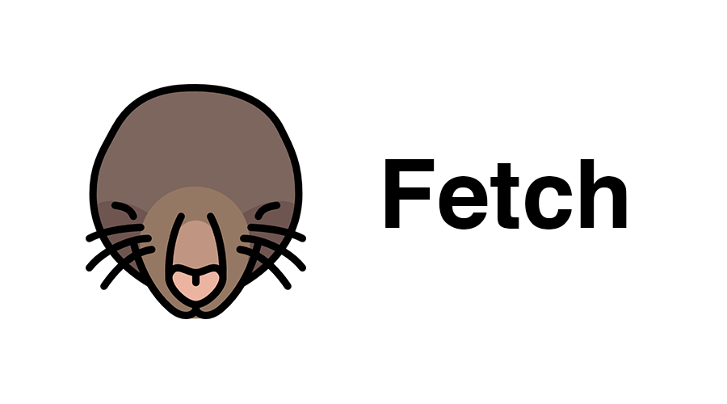

[](https://badge.fury.io/js/mole-fetch)
[](https://www.npmjs.com/package/mole-fetch)
[](https://opensource.org/licenses/Apache-2.0)

# Mole Fetch

Mole Fetch assists in making background HTTP requests by using Service Workers and Fetch API.

Mole Fetch allows HTTP requests to run in the background, even if the users have accidentally closed a browser, or the network has disconnected. This library uses Service Workers and Synchronization Managers.

## Installation

```
npm install --save mole-fetch
```
or
```
git clone https://github.com/thangman22/mole-fetch.git
```

## Usage Example

### HTML file
```javascript
const moleFetch = new MoleFetch()

function fetchFacebook() {
    //Call sendRequest for request HTTP
    moleFetch.sendRequest('facebook', 'http://localhost:5555/mock-api/online', false, 'GET')
}

// Register Service Wokers
if ('serviceWorker' in navigator && 'SyncManager' in window) {
    navigator.serviceWorker.register("sw.js").then((registration) => {
        console.log('Service Workers registration successful with scope: ', registration.scope)
    }).catch(function(err) {
        console.error('Service Workers registration failed: ', err)
    })
}

// Implement onResponse for recieve response from ServiceWorker when site is online
moleFetch.onResponse('facebook').then((value) => {
    document.getElementById("result").innerHTML = value;
})

// Implement onResponse for recieve response from Cache when site is offline
moleFetch.getCacheResponse('facebook',false).then((value) => {
    document.getElementById("result").innerHTML = value;
})
```

### Service Workers file
```javascript
importScripts('node_modules/localforage/dist/localforage.min.js')
importScripts('node_modules/mole-fetch/dist/mole-fetch.js')

self.addEventListener('install', (event) => {
  self.skipWaiting()
})

self.addEventListener('activate', (event) => {
  event.waitUntil(self.clients.claim())
})

self.addEventListener('sync', (event) => {
  let moleFetch = new MoleFetch
  moleFetch.initBackgroudfetch(event)
})

```
## Method API

#### sendRequest (taskName, url, data, method)

This method will be send request to ServiceWorker and request via FetchAPI

#### moleFetch.onResponse(taskName)

This method will wating result from FetchAPI matched by name return as Promise

#### moleFetch.getCacheResponse(taskName)

This method will get result from Cache that created when browser offline and matched by name as Promise

#### moleFetch.getTaskStatus(taskName)

This method will get return status by taskName

## Browser Supported

| [](http://godban.github.io/browsers-support-badges/)</br>Edge | [](http://godban.github.io/browsers-support-badges/)</br>Firefox | [](http://godban.github.io/browsers-support-badges/)</br>Chrome | [](http://godban.github.io/browsers-support-badges/)</br>Safari | [](http://godban.github.io/browsers-support-badges/)</br>Opera | 
| --------- | --------- | --------- | --------- | ---------
| 15+ (Flag) | 55+ | 49+ | *10.1+ | 47+

Note: Safari browser is not supported Service Workers. 

## Contribution

If you’ve found an error in this library, please file an issue at: https://github.com/thangman22/mole-fetch/issues.

Patches are encouraged, and may be submitted by forking this project and submitting a pull request through GitHub.

## License

Copyright 2016-2017 Warat Wongmaneekit.

Licensed under the Apache License, Version 2.0 (the "License"); you may not use this file except in compliance with the License. You may obtain a copy of the License at

http://www.apache.org/licenses/LICENSE-2.0

Unless required by applicable law or agreed to in writing, software distributed under the License is distributed on an "AS IS" BASIS, WITHOUT WARRANTIES OR CONDITIONS OF ANY KIND, either express or implied. See the License for the specific language governing permissions and limitations under the License.

